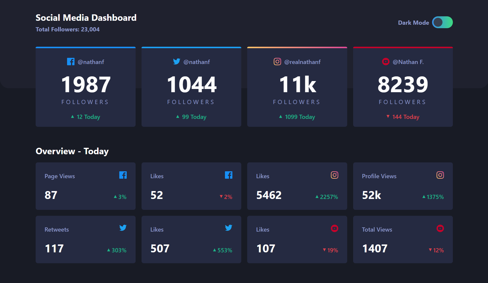

# Frontend Mentor - Social media dashboard with theme switcher solution

This is a solution to the [Social media dashboard with theme switcher challenge on Frontend Mentor](https://www.frontendmentor.io/challenges/social-media-dashboard-with-theme-switcher-6oY8ozp_H). Frontend Mentor challenges help you improve your coding skills by building realistic projects.

## Overview

### The challenge

Users should be able to:

- Toggle color theme to their preference
- View the optimal layout for the site depending on their device's screen size
- See hover states for all interactive elements on the page

### Design

### Screenshot

### Links

- Solution URL: [Solution](./solution/)
- Live Site URL: [Live site](https://dulcet-kashata-e8bd6f.netlify.app/)

## My process

### Built with

- [React](https://reactjs.org/) - JS library
- [Tailwind CSS](https://tailwindcss.com/) - Utility-first CSS framework
- [Vite](https://vitejs.dev/) - JavaScript build tool for optimized application
- Flexbox
- CSS Grid
- Mobile-first workflow

## Author

- LinkedIn - [Daniel Westerlund](https://www.linkedin.com/in/daniel-westerlund-a07529179/)
- Website - [GitHub Pages](https://danielw720.github.io/)
- Frontend Mentor - [@DanielW720](https://www.frontendmentor.io/profile/yourusername)
